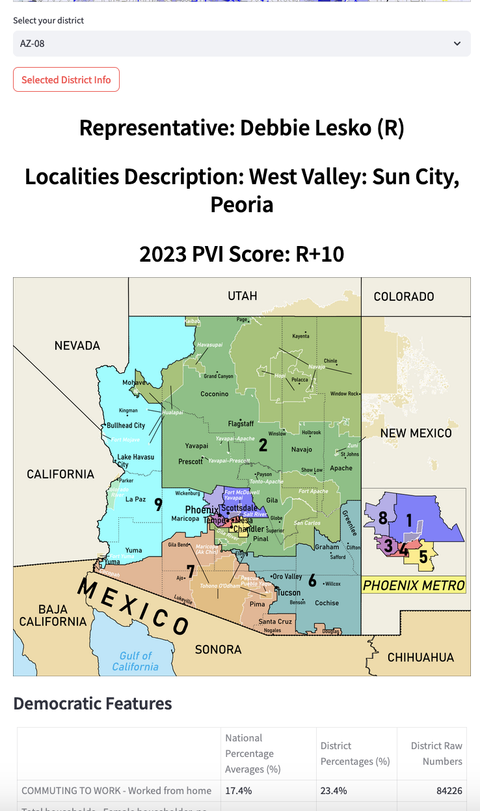

<h2 align="center">The New Demographic Battlefield</h2>
<h3 align="center"> A Post-Redistricting Analysis of Partisan Lean and 2022 Midterm Voter Behavior in U.S. Congressional Districts</h3>

  
  
  <h3 align="center">
    Strategic Insights for Democratic Congressional Campaigns Using American Community Survey Profiles on Demographics, Economics, Housing, and Social Characteristics
  </h3>
  
 

    <a href="https://2022midterms.streamlit.app/"><strong>Explore the Interactive Streamlit App!</strong></a>
     
    Dive into the detailed outcomes of the 2022 midterms for any US Congressional District.
     
    
  

The American Community Survey (ACS), conducted annually by the Census Bureau, offers a detailed snapshot of the U.S. population, expanding beyond the Decennial Census's basic household data. By sampling approximately 3.5 million addresses each year, the ACS provides a comprehensive overview of social, economic, housing, and demographic details at a level of depth unmatched in the ten-year census.

On January 26, 2023, the Census Bureau released the 2021 ACS data tables within the geographic boundaries of the 118th Congress. This release is critical for shaping Democratic electoral strategies in the decade ahead; following the 2020 census, redistricting reshaped virtually every U.S. district, making these data profiles our first deep dive into the redefined district landscapes. While future legal decisions may alter some district boundaries, the majority will likely remain stable over the next decade.

The ACS presents this data across four Data Profile tables, offering a clear and detailed view of each district's constituents:
* <b><u>Social Profile</b></u>: Encompasses household dynamics, educational pursuits, veteran and disability status, migration patterns, linguistic diversity, and digital connectivity.
* <b><u>Economic Profile</b></u>: Sheds light on workforce dynamics, commuting patterns, occupational and industrial distributions, income levels, health insurance coverage, and poverty rates.
* <b><u>Housing Profile</b></u>: Provides insights into housing occupancy and characteristics, ownership versus renting, vehicle availability, energy sources, and housing costs.
* <b><u>Demographic Profile</b></u>: Details the demographic makeup in terms of gender, age, racial and ethnic backgrounds, and the citizen voting-age population.

These profiles collectively offer a comprehensive overview of each district's characteristics, crucial for understanding the evolving electoral landscape in the wake of recent redistricting.
