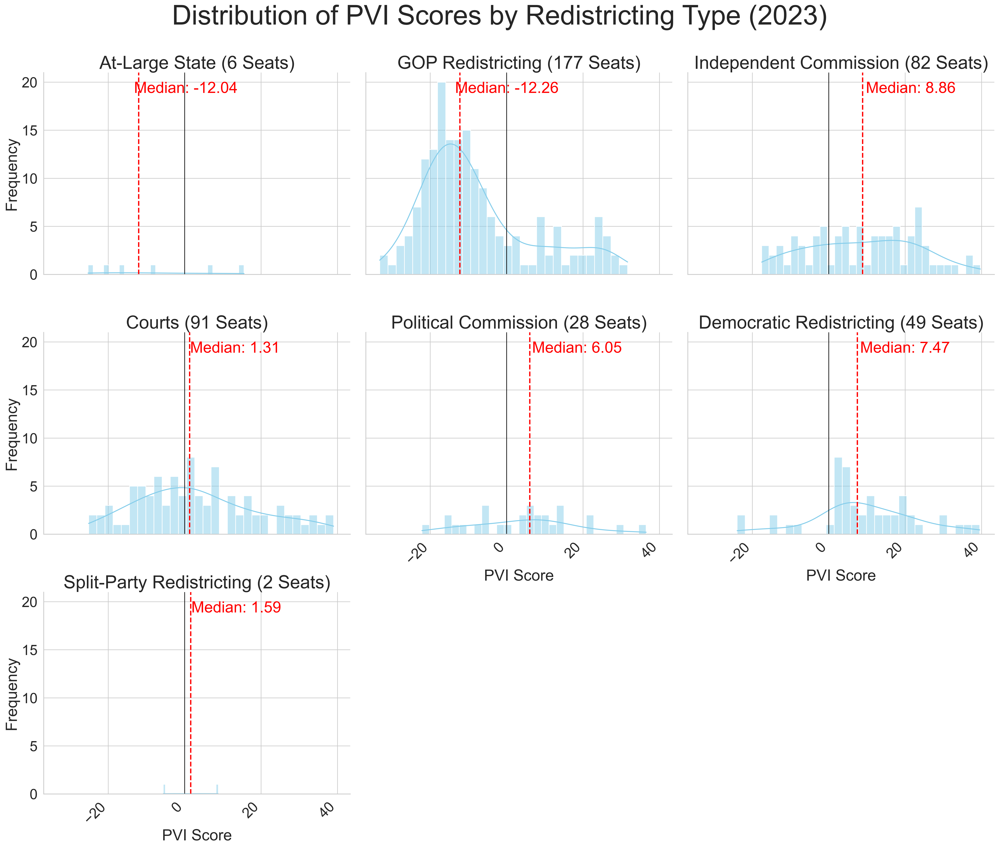

  <!-- PROJECT LOGO -->
 

        
  <!--a href="http://2022midterms.streamlit.app/"><strong>Explore My Interactive Streamlit App for US Congressional Districts!</strong></a><a href="http://2022midterms.streamlit.app/">
    <!--img src="images/streamlit-mark-color.png" alt="Logo" width="100" height="80"-->
  </a>
  

  

   <a href="http://2022midterms.streamlit.app/">Top Dem & GOP Characteristics </a>- <a href="http://2022midterms.streamlit.app/">Predict 2022 midterm margins</a>
  

<h2 align="center">           </h2>
<h2 align="center">The New Demographic Battlefield</h2>
<h3 align="center"> A Post-Redistricting Analysis of Partisan Lean and 2022 Midterm Voter Behavior in U.S. Congressional Districts</h3>

  
  
  <h3 align="center">
    Strategic Insights for Democratic Congressional Campaigns Using American Community Survey Profiles on Demographics, Economics, Housing, and Social Characteristics
  </h3>

  
<!-- TABLE OF CONTENTS -->
<!--details-->
  
 Table of Contents 

  <ol>
    <li>
      <a href="#introduction">Introduction</a>
    </li>
    <li>
      <a href="#background-information">Background Information</a>
      <ul>
        <li><a href="#american-community-survey">American Community Survey</a></li>
        <li><a href="#cook-partisan-voter-index-scores">Cook Partisan Voter Index Scores</a></li>
      </ul>
    </li>
    <li><a href="#data-used">Data Used</a></li>
          <ul>
        <li><a href="#data-wrangling-notebook">Data Wrangling Notebook</a></li>
              </ul>
    <li><a href="#exploratory-data-analysis">Exploratory Data Analysis</a></li>
                    <ul>
        <li><a href="#distribution">Distribution</a></li>
        <li><a href="#heatmapping">Heatmapping</a></li>
        <li><a href="#eda-notebook">EDA Notebook</a></li>
              </ul>
    <li><a href="#models-and-analysis">Models and Analysis</a></li>
                  <ul>
        <li><a href="#regressors-and-analysis-notebook">Regressors and Analysis Notebook</a></li>
              </ul>
    <li><a href="#results">Results</a></li>
    <li><a href="#recommendations">Recommendations</a></li>
    <li><a href="#future">Future Work</a></li>
  </ol>
<!--/details-->

## Introduction
The purpose of this project is to analyze and understand, on a more granular level, the constituents of the newly settled congressional district landscape of the 2020’s. I wanted to consider more than just age, race, and education, so I incorporated 450 unique features for every district in the US (from employment industry, to daily commute time, to heating fuel source, and many many others).  

I modeled these characteristics to predict the district’s Partisan Voter Index scores (a measure of its partisan lean) and then remodeled to predict 2022 midterm voter behavior in these districts.  

Hopefully, my analysis and insights can help inform democratic strategy to help win back the US house and keep it for the decade ahead. 

(<a href="#readme-top">back to top</a>)

## Background Information
### American Community Survey
On January 26, 2023, the Census Bureau released the 2021 ACS data tables within the geographic boundaries of the 118th Congress. This release is critical for determining Democratic electoral strategies in the decade ahead; following the 2020 census, redistricting reshaped virtually every U.S. district, making these data profiles our first deep dive into the redefined district landscapes. While future legal decisions may alter some district boundaries, the majority will likely remain stable over the next decade.  

The American Community Survey is a sample of approximately 3.5 million addresses each year, and takes a much more comprehensive look at the characteristics of the U.S. population, as compared to its cousin the Decennial Census. The Census Bureau releases this data across four Data Profile tables, offering a clear and detailed view of each district's constituents:
- **Social Profile:** Encompasses household dynamics, educational pursuits, veteran and disability status, migration patterns, linguistic diversity, and digital connectivity.
- **Economic Profile:** Sheds light on workforce dynamics, commuting patterns, occupational and industrial distributions, income levels, health insurance coverage, and poverty rates.
- **Housing Profile:** Provides insights into housing occupancy and characteristics, ownership versus renting, vehicle availability, energy sources, and housing costs.
- **Demographic Profile:** Details the demographic makeup in terms of gender, age, racial and ethnic backgrounds, and the citizen voting-age population. 

These profiles collectively offer a comprehensive overview of each district's characteristics, crucial for understanding the evolving electoral landscape in the wake of recent redistricting.

### Cook Partisan Voter Index Scores
I am going to spend a lot of time talking about each district’s PVI-score, so it’s helpful to understand what it actually represents and how it was determined.  

The Cook PVI measures how partisan a district or a state is compared to the nation as a whole. A Cook PVI score of D+2, for example, means that in the 2016 and 2020 presidential elections, that district performed an average of two points more Democratic than the nation did as a whole, while an R+4 means the district performed four points more Republican.  As of 2022, the calculation of PVI-scores are weighted more heavily to the most recent Presidential Election, instead of averaging the previous two cycles.  

Because “R+3” and “D+2” are not actual numbers for data analysis, I converted PVI to sit on a scale where Republican PVI’s are negative and Democratic PVI’s are positive, becoming “-3”and “2,” respectively. <a href="https://www.cookpolitical.com/cook-pvi">More information on PVI can be found here.</a>

(<a href="#readme-top">back to top</a>)

## Data Used
1. American Community Survey data for the 118th congressional districts can be accessed [here](https://www.census.gov/acs/www/data/congressional-and-state-legislative-districts/).
2. PVI score data was sourced from the [Cook Political Report](https://www.cookpolitical.com/cook-pvi/2023-partisan-voting-index/118-district-map-and-list).
3. 2022 Midterm Results were sourced from [The Daily Kos](https://www.dailykos.com/stories/2022/9/21/1742660/-The-ultimate-Daily-Kos-Elections-guide-to-all-of-our-data-sets).
4. Information about who controlled the redistricting process in each state was compiled by the [Brennan Center for Justice](https://www.brennancenter.org/our-work/research-reports/who-controlled-redistricting-every-state).

#### QUICK NOTE:
I know you’re not supposed to talk about the data wrangling process, but it’s worth noting that a) it was a monster of a task, but more importantly b) when the 2022 ACS data is released and the state legislative districts data is released, my wrangling process will work with almost no changes to the underlying code. Anything that is changed year to year between ACS surveys is released [here,](https://www.census.gov/programs-surveys/acs/technical-documentation/table-and-geography-changes/2022.html) so adjustments can be pinpointed easily.

#### Data Wrangling Notebook
Follow along step by step with how I wrassled the data into submission in my [data wrangling notebook](https://github.com/samforwill/District-Insights/blob/main/01_Data_Wrangling_ACS_Surveys.ipynb).

(<a href="#readme-top">back to top</a>)

## Exploratory Data Analysis
### Distribution

First, I wanted to get a sense of how the newly shaped districts were distributed according to their partisan-ness. Distributing every district in the US based on PVI-score shows this interesting shape:

Well, that certainly doesn’t look normal! (in the statistical distribution sense of “normal”, but also in the common sense department). So lets dive in!  

The median district in the United States is around -1, which is a Republican +1 district, meaning half of the districts in the US are more Republican and half are more Democratic than that point. Pretty close to 0, so I’m not mad at that. 

But, right off the bat, we see a huge imbalance and large concentration of districts between the R+10 to R+20 range,(-10 to -20 in my conversion). For context,  Cook considers everything beyond the 10-point range to be non-competitive “Solid” districts.

Of course, my initial thought on seeing this is:

> **"Who could possibly be responsible for creating this huge concentration of districts that are *just* out of competitive reach? 🤔 And why is the answer almost certainly 'Republicans gerrymandering'🤨???**

So, I set about to confirm my priors. The Brennan Center for Justice [broke down ](https://www.brennancenter.org/our-work/research-reports/who-controlled-redistricting-every-state)redistricting in every state into the following categories: 
* GOP-Controlled Redistricting (177 seats)
* Democratic-Controlled Redistricting (49 seats)
* Split-Control (2 seats)
* Court-Ordered Maps (91 seats)
* Independent Commissions [non-partisan] (82 seats)
* Political Commissions [partisan appointees from both parties](28 seats)
* and At-Large Districts (6 seats/states)

Now, when we look at the same distribution graph color-coded by type of redistricting, I have a feeling we should see something pretty notable in that -10 to -20 range.

  

### It's a little hard to focus with all those colors going on in the same graph, so let's break it down into its component parts:

### Observations:
**Courts & Commissions**: As far as distribution goes, courts and commissions have the most natural spread, which makes sense given their priority to create fair districts. The median of the commissions is between 6-8, but this makes sense given that states with commissions tend to be more democratic overall (CA, CO, MI, AZ, HI, ID, MO, NJ, WA) 

**GOP-Controlled Redistricting**: Republicans had the opportunity to draw the district lines in an astonishing 41% of all seats in Congress (177 total). As awful as that is for democracy and discourse overall, it makes it pretty easy to visually see the manipulation of district-drawing to create electoral advantages. 
- The median district is R+12, so, solidly safe districts for Republicans, but even more interesting is the immediate dropoff of districts exceeding R+20, indicating **"cracking"**, where, once a Republican district is safe enough, they can crack into more democratic areas like urban centers.
- And then notice the second hump of GOP-drawn democratic districts in the D+20 region, indicating **"packing"**, where democratic voters are packed into one district to dilute their voting power  

**Democratic-Controlled Redistricting**: The median district is D+7, within the competitive zone. Perhaps Democrats would see more GOP-type drawing behavior if we had more opportunitis to hold the pen, but at 49 seats total, our ability to push back on the GOP's advantage is severely limited.

(<a href="#readme-top">back to top</a>)

### Heatmapping
Because I only eliminated in the data wrangling/cleaning process those features that were *exactly* duplicated within and between data profiles, I wanted to get a sense of the extent of multicollinearity of my features and chose to do that through heatmapping. 
Since my data also has high dimensionality (450 unique features), I will only share here one of my heatmaps corresponding to the demographic profile highlighting highly correlated features. 

Here it's easy to see many of the features are highly correlated, and many of those relationships make sense intuitively. So let's look at only the top 50 highly correlated pairs of features in the graph below (open in new window, Census Bureau characteristic titles can be very long):

Some of the features have an almost exact negative correlation, such as "Place of Birth - Foreign Born" and "Place of Birth - Native Born", but there are also some highly correlated pairs that don't exactly hit perfect correlation such as "Total Population" and "Total Population 1 year and over".

#### EDA Notebook
To take a more detailed look at the EDA process, especially a deeper look into all the heatmapping, follow along in my [EDA Notebook](https://github.com/samforwill/District-Insights/blob/main/02_Exploratory_Data_Analysis.ipynb).

**EDA Conclusions**:
1) The distribution of districts is skewed by Republican gerrymandering
2) My data has high dimensionality (450 features) high multicollinearity (closely related features) and low observations (only 435 districts in the U.S)
3) To handle the high dimensionality and multicolinearity of my data, I am choosing to focus on regressors that are adept at handling these challenges. 

(<a href="#readme-top">back to top</a>)

## Models and Analysis
Given the high dimensionality and multicolinearity of my data, I chose to only focus on regressors that could handle these challenges, such as L1 and L2 regularization regressors, and Ensemble Learning models.  
Although I had some decent accuracy with Neural Networks and Principal Component Regression, eventually I sacked those methods because it's not possible to extract the features and associated weights for analysis. 

Models Assessed:
- Ridge
- Lasso
- ElasticNet
- RandomForestRegressor
- ExtraTreesRegressor
- GradientBoostingRegressor

1. **Modeling on PVI**:  
After several rounds of parameter tuning on all of the above models, I sorted on highest performance R²-Score on the test set. In all instances, the top 5 performing models were all Ridge Regression, signaling its efficacy in managing multicollinearity within the high dimensional demographic feature set. 

Specifically, Ridge with MinMax Scaling and L2-regularization alpha of 1.  
The leading model also has the lowest RMSE at 4.365, meaning our model can predict the PVI of a district within ±4.365 points. That's pretty great!  
The collective performance of these models underscores Ridge Regression's suitability for demographic-based PVI score prediction, with significant implications for targeted campaign strategies.

2. **Modeling on 2022 Midterm Margins**:  
Using the same process and models as in the PVI modeling, after several iterations of parameter tuning, my highest performing models were: 
  
Although ElasticNet with MinMax Scaler had the highest R²-Score on the test set, I chose to use the Lasso with MinMax scaler alpha 0.1 as my best model based on the other metrics.  
The ElasticNet model seems to be significantly overfitting on its training data, while the Lasso model shows more consistency between Mean CV Score, R2 Test Score, and R-squared Training data. Also, the difference in my most important metric (RMSE) is negligible
