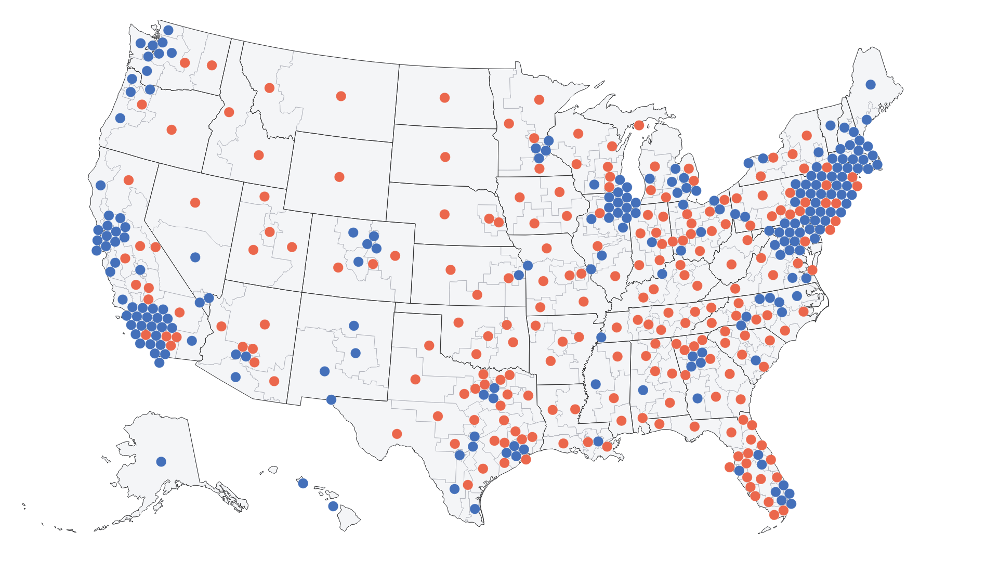

  <!-- PROJECT LOGO -->
 

        <!-- a href="http://2022midterms.streamlit.app/">
    < img src="images/streamlit-mark-color.png" alt="Logo" width="100" height="80">
  </a -->
  <a href="http://2022midterms.streamlit.app/"><strong>Explore My Interactive Streamlit App for US Congressional Districts!</strong></a><a href="http://2022midterms.streamlit.app/">
    <!--img src="images/streamlit-mark-color.png" alt="Logo" width="100" height="80"-->
  </a>
  

  

 Top Dem & GOP Characteristics - Predict 2022 midterm margins
  

<h2 align="center">The New Demographic Battlefield</h2>
<h3 align="center"> A Post-Redistricting Analysis of Partisan Lean and 2022 Midterm Voter Behavior in U.S. Congressional Districts</h3>

  
  
  <h3 align="center">
    Strategic Insights for Democratic Congressional Campaigns Using American Community Survey Profiles on Demographics, Economics, Housing, and Social Characteristics
  </h3>

  
<!-- TABLE OF CONTENTS -->

  
Table of Contents

  <ol>
    <li>
      <a href="#introduction">Introduction</a>
    </li>
    <li>
      <a href="#background-information">Background Information</a>
      <ul>
        <li><a href="#ACS">American Community Survey</a></li>
        <li><a href="#PVI">Cook Partisan Voter Index Scores</a></li>
      </ul>
    </li>
    <li><a href="#data">Data Used</a></li>
          <ul>
        <li><a href="#wranglingnotebook">Data Wrangling Notebook</a></li>
              </ul>
    <li><a href="#eda">Exploratory Data Analysis</a></li>
              <ul>
        <li><a href="#edanotebook">EDA Notebook</a></li>
              </ul>
    <li><a href="#analysis">Models and Analysis</a></li>
                  <ul>
        <li><a href="#analysisnotebook">Regressors and Analysis Notebook</a></li>
              </ul>
    <li><a href="#results">Results</a></li>
    <li><a href="#recommendations">Recommendations</a></li>
    <li><a href="#future">Future Work</a></li>
  </ol>

## Introduction
The purpose of this project is to analyze and understand, on a more granular level, the constituents of the newly settled congressional district landscape of the 2020’s. I wanted to consider more than just age, race, and education, so I incorporated 450 unique features for every district in the US (from employment industry, to daily commute time, to heating fuel source, and many many others).  

I modeled these characteristics to predict the district’s Partisan Voter Index scores (a measure of its partisan lean) and then remodeled to predict 2022 midterm voter behavior in these districts.  

Hopefully, my analysis and insights can help inform democratic strategy to help win back the US house and keep it for the decade ahead. 

## Background
### American Community Survey-- 
On January 26, 2023, the Census Bureau released the 2021 ACS data tables within the geographic boundaries of the 118th Congress. This release is critical for determining Democratic electoral strategies in the decade ahead; following the 2020 census, redistricting reshaped virtually every U.S. district, making these data profiles our first deep dive into the redefined district landscapes. While future legal decisions may alter some district boundaries, the majority will likely remain stable over the next decade.  

The American Community Survey is a sample of approximately 3.5 million addresses each year, and takes a much more comprehensive look at the characteristics of the U.S. population, as compared to its cousin the Decennial Census. The Census Bureau releases this data across four Data Profile tables, offering a clear and detailed view of each district's constituents:
- **Social Profile:** Encompasses household dynamics, educational pursuits, veteran and disability status, migration patterns, linguistic diversity, and digital connectivity.
- **Economic Profile:** Sheds light on workforce dynamics, commuting patterns, occupational and industrial distributions, income levels, health insurance coverage, and poverty rates.
- **Housing Profile:** Provides insights into housing occupancy and characteristics, ownership versus renting, vehicle availability, energy sources, and housing costs.
- **Demographic Profile:** Details the demographic makeup in terms of gender, age, racial and ethnic backgrounds, and the citizen voting-age population. 

These profiles collectively offer a comprehensive overview of each district's characteristics, crucial for understanding the evolving electoral landscape in the wake of recent redistricting.
### Partisan Voter Index Scores (Cook PVI℠)--
I am going to spend a lot of time talking about each district’s PVI-score, so it’s helpful to understand what it actually represents and how it was determined.  

The Cook PVI measures how partisan a district or a state is compared to the nation as a whole. A Cook PVI score of D+2, for example, means that in the 2016 and 2020 presidential elections, that district performed an average of two points more Democratic than the nation did as a whole, while an R+4 means the district performed four points more Republican.  As of 2022, the calculation of PVI-scores are weighted more heavily to the most recent Presidential Election, instead of averaging the previous two cycles.  

Because “R+3” and “D+2” are not actual numbers for data analysis, I converted PVI to sit on a scale where Republican PVI’s are negative and Democratic PVI’s are positive, becoming “-3”and “2,” respectively. <a href="https://www.cookpolitical.com/cook-pvi">More information on PVI can be found here.</a>

## Data Used
1. American Community Survey data for the 118th congressional districts can be accessed [here](https://www.census.gov/acs/www/data/congressional-and-state-legislative-districts/).
2. PVI score data was sourced from the [Cook Political Report](https://www.cookpolitical.com/cook-pvi/2023-partisan-voting-index/118-district-map-and-list).
3. 2022 Midterm Results were sourced from [The Daily Kos](https://www.dailykos.com/stories/2022/9/21/1742660/-The-ultimate-Daily-Kos-Elections-guide-to-all-of-our-data-sets).
4. Information about who controlled the redistricting process in each state was compiled by the [Brennan Center for Justice](https://www.brennancenter.org/our-work/research-reports/who-controlled-redistricting-every-state).

#### QUICK NOTE:
I know you’re not supposed to talk about the data wrangling process, but it’s worth noting that a) it was a monster of a task, but more importantly b) when the 2022 ACS data is released and the state legislative districts data is released, my wrangling process will work with almost no changes to the underlying code. Anything that is changed year to year between ACS surveys is released [here,](https://www.census.gov/programs-surveys/acs/technical-documentation/table-and-geography-changes/2022.html) so adjustments can be pinpointed easily.

Follow along step by step with how I wrassled the data into submission in my [data wrangling notebook](https://github.com/samforwill/District-Insights/blob/main/01_Data_Wrangling_ACS_Surveys.ipynb).

## Exploratory Data Analysis
### Distribution--

First, I wanted to get a sense of how the newly shaped districts were distributed according to their partisan-ness. Distributing every district in the US based on PVI-score shows this interesting shape:

Well, that certainly doesn’t look normal! (in the statistical distribution sense of “normal”, but also in the common sense department). So lets dive in!  

The median district in the United States is around -1, which is a Republican +1 district, meaning half of the districts in the US are more Republican and half are more Democratic than that point. Pretty close to 0, so I’m not mad at that. 

But, right off the bat, we see a huge imbalance and large concentration of districts between the R+10 to R+20 range,(-10 to -20 in my conversion). For context,  Cook considers everything beyond the 10-point range to be non-competitive “Solid” districts.

Of course, my initial thought on seeing this is:

> **"Who could possibly be responsible for creating this huge concentration of districts that are *just* out of competitive reach??? 🤔**

So, I set about to confirm my priors.  

The Brennan Center for Justice  broke down who controlled redistricting in every state [(here)](https://www.brennancenter.org/our-work/research-reports/who-controlled-redistricting-every-state) into the following categories: 
* GOP-Controlled Redistricting 
* Democratic-Controlled Redistricting
* Split-Control 
* Court-Ordered Maps
* Independent Commissions (non-partisan)
* Political Commissions (composed of partisan appointees and politicians from both parties)
* and At-Large District

Now, when we look at the same distribution graph color-coded by type of redistricting, I have a feeling we should see something pretty notable in that -10 to -20 range.

Surprise! Surprise! 
